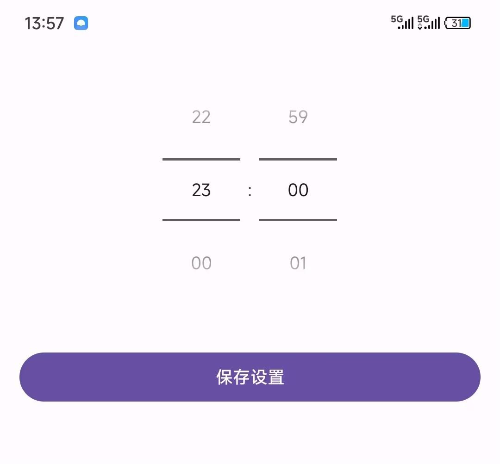
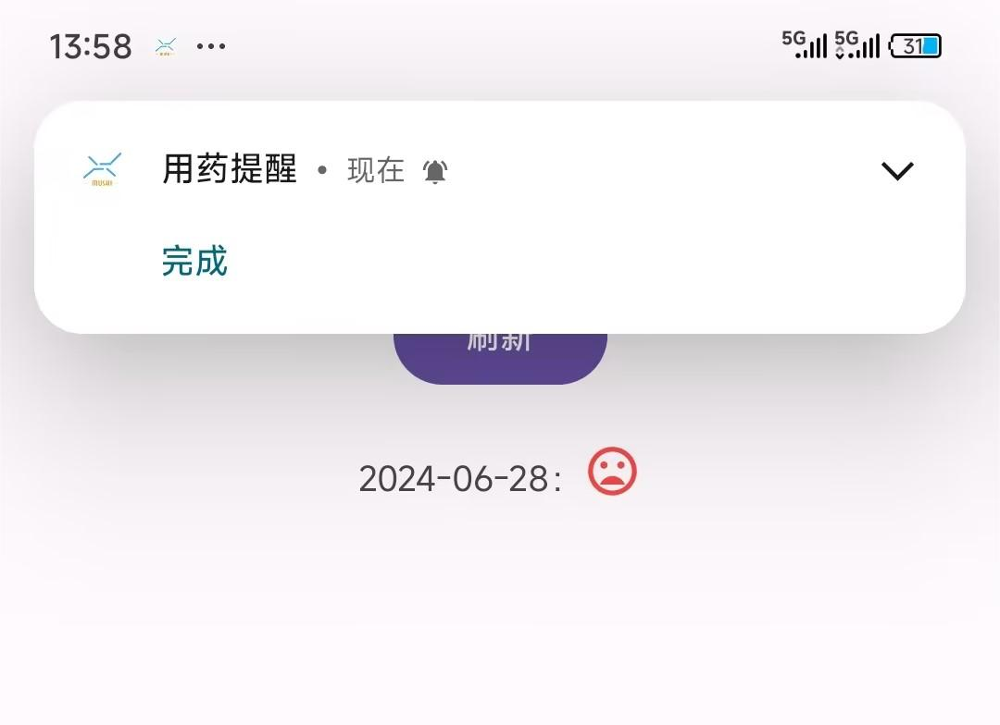

# 说明
本项目是为了满足个人日常生活中常见的一些问题而开发的轻量级安卓应用。

大部分使用场景是用于接受通知，并快速进行操作

# 功能
## 用药提醒
### 需求
由于我妈接手了甲状腺切除手术，需要长期每天复用药物，为了避免遗忘而漏吃药，需要一个用药提醒的功能

市面上其实已经有很多用药提醒的应用了，调研后发现这些应用有如下缺点：
- 应用太重了，为了营收，很多都集成了不止用药提醒的功能，占用内存大
- 从配置到使用太过繁琐
- 有广告
- 需要联网，较为耗电
- 通知机制不满足我的需求，不能快捷操作

因此开发了一个简单的用药提醒功能
### 功能
#### 配置用药时间
目前用药每天仅需吃一次，因此只有一个配置，设置好时间之后，每天会在这个时间点判断今天是否已吃药，如果没有吃药就会推送消息，并且如果一直没有吃药，会每隔15分钟再推一次消息，重复推三次

#### 用药列表-未用药
当天是未吃药状态时，用药记录列表中的状态是红色小人头

#### 用药提醒消息
提醒消息中包含有操作按钮，点击后，会弹出快捷操作界面，方便操作

#### 用药快捷操作
提供系统磁贴功能，方便随时更新当天的吃药状态

吃完药了是点亮状态，未吃完是灰色状态，第二天（24点之后）会重置为未吃药的灰色状态

#### 用药列表-已用药
当天是已吃药状态时，用药记录列表中的状态是绿色小人头

